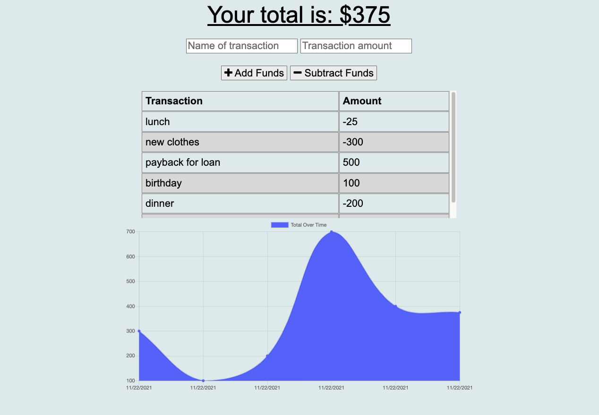
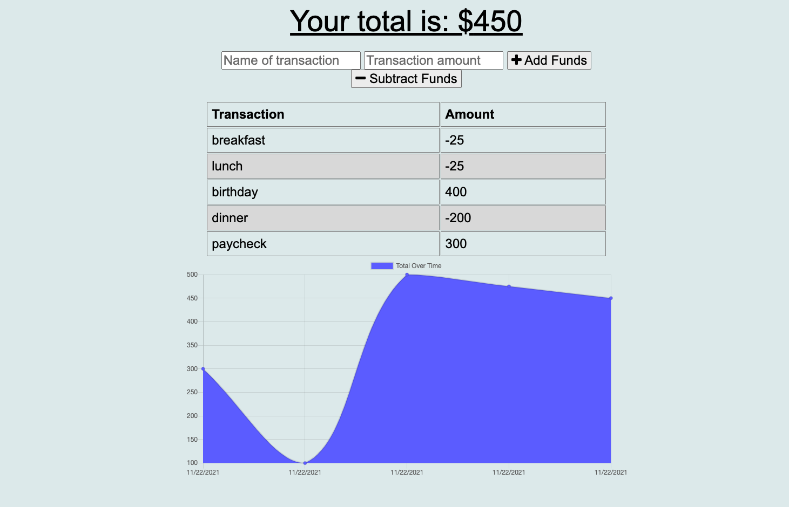

# Budget Tracker

  

  ## Description

  I added to and modified existing budget tracker code to allow for offline access and functionality.
  
  ## Deployed link

  Click the link below to visit my deployed page.

 https://sheltered-earth-47925.herokuapp.com/

  ## Table of Contents
  
  * [Goals](#goals)

  * [Usage](#usage) 

  * [Installation](#installation)  

  * [Test](#test)

  * [Problems](#problems)

  * [Visualization](#visualization)

  * [Acknowledgements](#acknowledgements)

  * [Contributions](#contributions)

  * [Resources](#resources)

  * [License](#license) 

  * [Contact](#contact) 

  
  ## Goals

  I wanted to create a web application that allows a user to track income and expenses, I wanted to make it functional both on and off line.

  ## Motivation

  Proper budget tracking can lead to increased financial security and comfort, this application allows for users to focus more on what they want to do instead of worrying about their current financial status.

  ## Usage

  This application can be used both online and offline to assist in tracking financial transactions.

  ## Installation
  
  >`npm i`     
  
  followed by   
  
  >`node server.js`  

  ## Test

  N/A

  ## Problems

  Getting the offline functionality working proved to be difficult but I'm glad that I was able to work through the issues.

  ## Visualization

  

  

  ## Acknowledgements

  Brent Graves was very helpful in helping me figure out the offline functionality issues.  

  ## Contributions

  Email me or submit a pull request

  ## Resources
 
  This application utilizes Express and MongoDB

  ## License

  

  This projet uses MIT. 
  
  The link to the License can be found here (https://opensource.org/licenses/MIT)

  ## Contact
  
  GitHub Username: FenixS83 [@FenixS83](https://github.com/FenixS83)

  fenix.sampson@gmail.com

